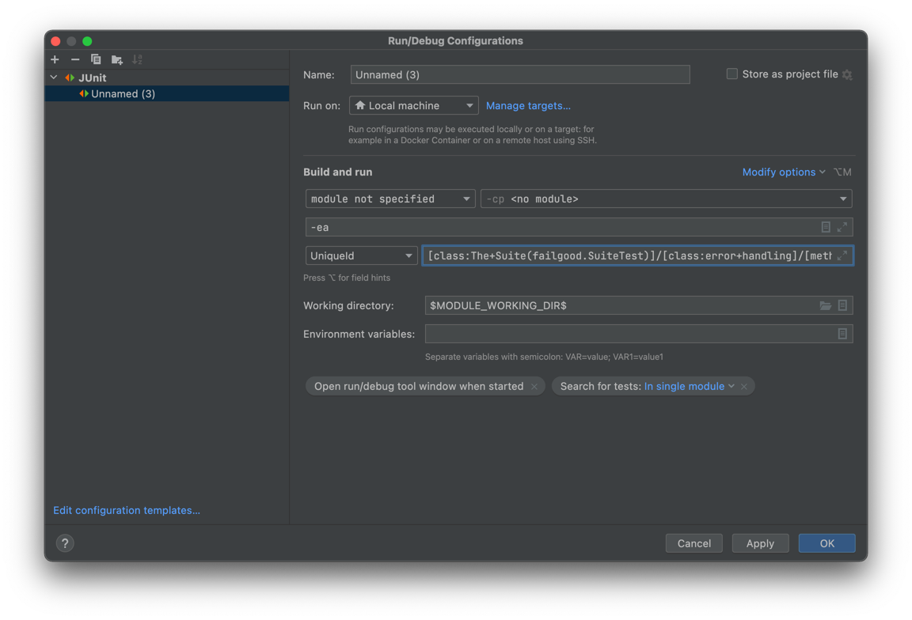

[](https://maven-badges.herokuapp.com/maven-central/dev.failgood/failgood)
[](https://github.com/failgood/failgood/actions)

# FailGood

Failgood is a test runner for Kotlin focusing on simplicity, usability and speed. Now including a simple mock library.
Still zero dependencies.

## Goals / Features

Every design decision is only influenced by what's best for a short test feedback loop, and to make simple things simple
and complex things possible. No feature exists "because that's how JUnit works". Everything is driven by the needs of
people who write tests daily and iterate fast.

* Spec syntax implemented to work just [as expected](https://en.wikipedia.org/wiki/Principle_of_least_astonishment).
* Speed and parallel execution. FailGood's own test suite runs in < 1 second.
* Run your tests so fast that you can run all the tests on every change.
* Autotest to run only changed tests.
* Pitest plugin (see the build file).

## How to write tests with Failgood

### setUp / beforeEach

If you are used to junit you probably wonder where to place init code that you want to run before each test.
Failgood has no setUp or beforeEach, because it is not a good fit for kotlin's immutable `val`s.

Tests in other test runners sometimes look like this:
```kotlin
class MyTest {
    lateinit var myWebserver: Server

    @BeforeEach
    fun setUp() {
        myWebserver = Server()
    }

    @AfterEach
    fun tearDown() {
        myWebserver.close()
    }
}

```
In Failgood you just start your dependencies where you declare them, and define a callback to close them, so the failgood
equivalent of the above code is just:

```kotlin
val context = describe(MyServer::class) {
    val myWebserver = autoClose(Server()) {it.close()}
}

```

Test dependencies will be recreated for every test. It just works as expected. Failgood executes the context block again for each test to have separate instances of all test dependencies.

If you want a dependency to not be recreated for every test, just declare it outside the root context block, and if you have to close it, do it in an afterSuite callback.

```kotlin
class MyBeautifulTest {
    val myHeavyWeightTestDependency = KafkaDockerMegaMonolith()
    val context = describe("The web server") {
        afterSuite {
            myHeavyWeightTestDependency.close()
        }
        it("is fast") {
            // ...
        }
    }
}
```

### Parametrized tests

Failgood needs no special support for parametrized tests. You can just use `forEach` to create multiple versions of a test

```kotlin
val context = describe("String#reverse") {
    listOf(Pair("otto", "otto"), Pair("racecar", "racecar")).forEach { (input, output) ->
        it("reverses $input to $output") {
            assertEquals(output, input.reversed())
        }
    }
}

```
In the case of the above example you may even want to add more test inputs and outputs for better coverage.

### Gradle build

Just add a failgood dependency and configure gradle to use the Junit platform. Your build file could look like this:

```kotlin
repositories {
    mavenCentral()
}

dependencies {
    testImplementation("dev.failgood:failgood:0.5.3")
}
tasks.test {
    useJUnitPlatform {
        includeEngines("failgood") // this is optional, gradle finds the engine automatically.
    }
}
```

### Running the test in your favorite IDE

This will only work if your favorite IDE is IntelliJ IDEA (or android studio).
Failgood comes with a JUnit Platform Engine that should make it easy to run Failgood tests with IDEAs integrated test
runner. You can run all tests in a package, or run Single test classes (if they are annotated with failgood.Test)

For best results, select "run tests in IDEA" in your gradle settings, although running in gradle works pretty well too.

#### Re-running a failed test

Idea supports re-running tests from the test runner, but that does not work in most of the cases. So until jetbrains
fixes this, failgood prints a uniqueid next to each test failure.
For example this could be printed: `timestamp = 2022-02-17T18:21:16.367446, uniqueId to rerun just this test = [engine:failgood]/[class:The+Suite(failgood.SuiteTest)]/[class:error+handling]/[method:treats+errors+in+getContexts+as+failed+context]
`
then take the part from `[engine:failgood]` till the end of the line and create a junit run config from it:


you can also run a whole context via uniqueid, for example `[engine:failgood]/[class:The+Suite(failgood.SuiteTest)]/[class:error+handling]`

### Example test suites

To see it in action check out the [failgood-example project](./failgood-examples), or a project that uses Failgood, for example
[the "the.orm" test suite](https://github.com/christophsturm/the.orm)
or [the restaurant test suite](https://github.com/christophsturm/restaurant/tree/main/core/src/test/kotlin/restaurant)

## Running the Failgood test suite

to run FailGood's test suite just run `./gradlew check` or if you want to run it via idea just run
the `FailGoodBootstrap.kt` class.

## Test coverage

Failgood works well with the [kover](https://github.com/Kotlin/kotlinx-kover) plugin, and if you want real mutation coverage, there is also a pitest plugin. (See failgoods own build for an example pitest config)

## Even faster tests - best practices

* avoid heavyweight dependencies. the failgood test suite runs in < 1000ms. That's a lot of time for a computer, and a
  great target for your test suite. Slow tests are a code smell. An unexpected example for a heavyweight dependency is
  mockk, it takes about 2 seconds at first invocation. To avoid that you can use the simple mocking library that comes
  with failgood. (see [MockTest.kt](failgood/src/test/kotlin/failgood/mock/MockTest.kt))


## Avoiding global state

Failgood runs your tests in parallel, so you need to avoid global state.
* if you need a web server run it on a random port.
* if you need a database create a db with a random name for each test. (see the.orm)
  or run the test in a transaction that is rolled back at the end

## Autotest

This is an experimental feature from the early days of failgood, but it still works.
Stay tuned for improved autotest support in the future or use the current version it like described below, and tell me what you think about it.

Add a main method that just runs autotest:

```kotlin
fun main() {
    autoTest()
}
```

create a gradle exec task for it:

```kotlin
tasks.register("autotest", JavaExec::class) {
    mainClass.set("failgood.AutoTestMainKt")
    classpath = sourceSets["test"].runtimeClasspath
}
```

run it with `./gradlew -t autotest`anytime a test file is recompiled it will run. This works pretty well, but it's not
perfect, because not every change to a tested class triggers a recompile of the test class. Fixing this by reading
dependencies from the test classes' constant pool is on the roadmap.
