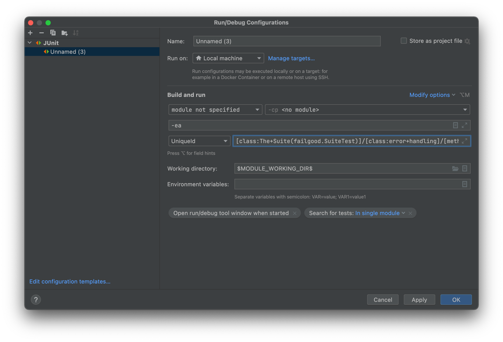

### Running the test in your favorite IDE

This will only work if your favorite IDE is IntelliJ IDEA (or android studio).
Failgood comes with a JUnit Platform Engine that should make it easy to run Failgood tests with IDEAs integrated test
runner. You can run all tests in a package, or run Single test classes (if they are annotated with failgood.Test)

For best results, select "run tests in IDEA" in your gradle settings.

### Running single tests

The latest idea versions (2022.1.1 preview and up) works very well with failgood. If you want to run just a single test
or a single subcontext, for easier debugging you can do so from the test results tree.

### Re-running a failed test

If rerunning single tests does not work out of the box, you can just create a run config for a single test or context manually.
To make this easier,  Failgood prints a UniqueId next to each test failure.
For example this could be printed: `timestamp = 2022-02-17T18:21:16.367446, uniqueId to rerun just this test = [engine:failgood]/[class:The+Suite(failgood.SuiteTest)]/[class:error+handling]/[method:treats+errors+in+getContexts+as+failed+context]
`
then take the part from `[engine:failgood]` until the end of the line and create a junit run config from it:

you can also run a whole context via UniqueId, for example `[engine:failgood]/[class:The+Suite(failgood.SuiteTest)]/[class:error+handling]`
