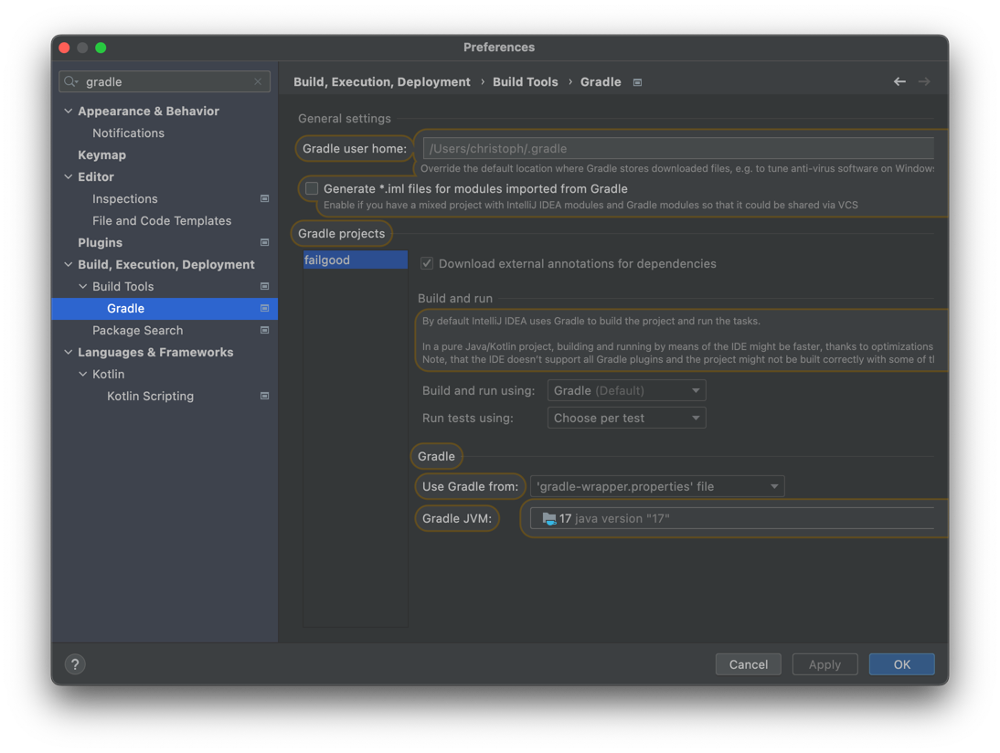

### Running the test in your favorite IDE

This will only work if your favorite IDE is IntelliJ IDEA (or android studio).
Failgood comes with a JUnit Platform Engine that should make it easy to run Failgood tests with IDEAs integrated test
runner. You can run all tests in a package, or run Single test classes (if they are annotated with failgood.Test)

For best results, select "run tests in IDEA" in your gradle settings, although running in gradle works pretty well too.

#### Re-running a failed test

Idea supports re-running tests from the test runner, but that is currently a big buggy. So until jetbrains
fixes this, Failgood prints a uniqueid next to each test failure.
For example this could be printed: `timestamp = 2022-02-17T18:21:16.367446, uniqueId to rerun just this test = [engine:failgood]/[class:The+Suite(failgood.SuiteTest)]/[class:error+handling]/[method:treats+errors+in+getContexts+as+failed+context]
`
then take the part from `[engine:failgood]` until the end of the line and create a junit run config from it:

you can also run a whole context via uniqueid, for example `[engine:failgood]/[class:The+Suite(failgood.SuiteTest)]/[class:error+handling]`

#### Tips
For best results we recommend running tests in idea (not in gradle) 

